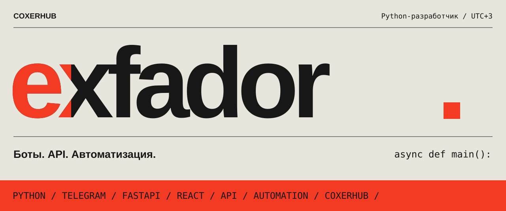
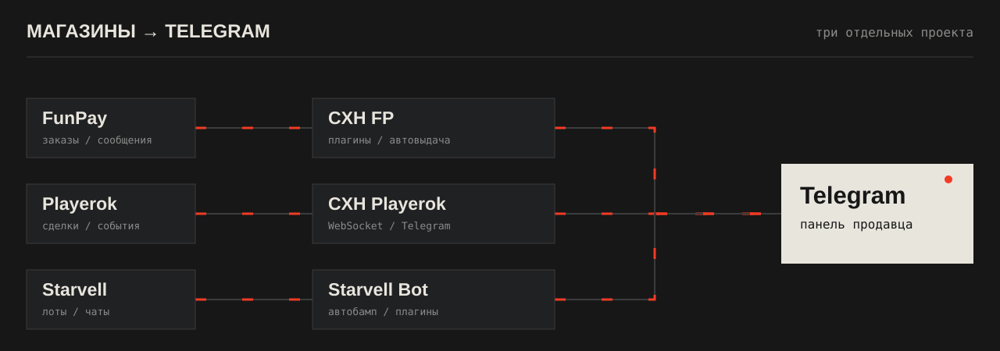
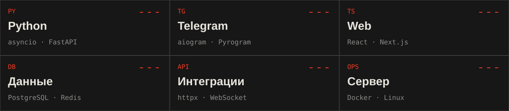

<picture>
  <source media="(max-width: 600px)" srcset="./assets/hero-mobile.svg">
  
</picture>

**[Написать в Telegram](https://t.me/exfador)** &nbsp; / &nbsp; [Канал COXERHUB](https://t.me/coxerhub) &nbsp; / &nbsp; [Репозитории](https://github.com/exfador?tab=repositories)

 

Пишу на **Python**. Делаю ботов, API и инструменты для продавцов на FunPay, Playerok и Starvell. Когда нужен интерфейс — React, Next.js или обычный JavaScript.

Здесь — мои публичные проекты. Разработка на заказ — **[@exfador](https://t.me/exfador)**.

 

## COXERHUB

<picture>
  <source media="(max-width: 600px)" srcset="./assets/ecosystem-mobile.svg">
  
</picture>

### [CXH FP](https://github.com/exfador/cxh-fp)

**Управление магазином FunPay из Telegram.**

Сообщения покупателей, заказы, цены и выдача товаров — в одном боте. Есть плагины, резервные копии и подписанные обновления с откатом. Работает на своём компьютере или сервере.

[Релизы](https://github.com/exfador/cxh-fp/releases) · [Установка на Ubuntu](https://github.com/exfador/install-cxh-fp) · [Канал проекта](https://t.me/funpay_coxerhub)

<b>Что внутри CXH FP</b>

- Заказы, переписка и шаблоны ответов в Telegram.
- Лоты, расчёт цены и автоматическая выдача цифровых товаров.
- Установка Python-плагинов и управление ими из панели.
- Резервные копии настроек и товаров.
- Проверка подписи релиза и возврат к предыдущему коду при неудачном обновлении.
- Windows, Linux, macOS и Docker; русский и английский интерфейс.

---

### [Playerok](https://github.com/exfador/playerok-api) &nbsp; / &nbsp; [Starvell](https://github.com/exfador/starvell_api)

Ещё два проекта для управления магазином через Telegram.

**Playerok** — неофициальный клиент и панель: события по WebSocket, чаты, сделки, автовыдача и поднятие объявлений.

**Starvell** — заказы, ответы покупателям, автобамп и плагины. Интерфейс на русском и английском.

[Канал Playerok](https://t.me/coxerhub_playerok) · [Канал Starvell](https://t.me/starvellapi)

 

## Другие проекты

**[Steam Guard Web](https://github.com/exfador/steam-desktop-authenticator-web)** 
Аутентификатор в браузере: 2FA-коды, подтверждения обменов и импорт `.maFile`. Node.js + Express, размещается у себя.

**[Midasbuy API](https://github.com/exfador/midasbuy-api)** 
Документация API для активации кодов и проверки игрока. Ключи доступа, квоты и история запросов.

**[Telegram Gifts](https://github.com/exfador/TG-MARKET-BOT)** 
Каталог подарков, цены в Stars и поиск дешёвых предложений на вторичном рынке Telegram.

<b>Небольшие утилиты и плагины</b>

- [Парсер Habr Freelance и Kwork](https://github.com/exfador/parser-freelance-habr-and-kwork) — сбор заказов с уведомлениями в Telegram.
- [Активные заказы FunPay](https://github.com/exfador/check_active_orders) — список незакрытых заказов и их идентификаторов.
- [Proxy checker](https://github.com/exfador/proxy-checker) — многопоточная проверка прокси и удаление дубликатов.
- [Бот-переводчик](https://github.com/exfador/translate-telegram-bot) — Telegram, перевод и озвучивание текста.

 

## С чем работаю

<picture>
  <source media="(max-width: 600px)" srcset="./assets/toolkit-mobile.svg">
  
</picture>

<b>Полный стек и интеграции</b>

| Область | Инструменты |
| :--- | :--- |
| Python и API | asyncio, FastAPI, Pydantic, aiohttp, httpx, SQLAlchemy |
| Telegram | aiogram, Pyrogram, Telethon, Web Apps |
| Данные | PostgreSQL, SQLite, Redis, Alembic |
| Интерфейсы | TypeScript, React, Next.js, Vite, Tailwind CSS |
| Парсинг | Playwright, BeautifulSoup, curl-cffi |
| Платежи | CryptoBot, YooKassa, FreeKassa |
| AI | OpenAI, Anthropic, Groq; RAG и tool calling |
| Развёртывание | Linux, Docker, Nginx, systemd |

Также делаю браузерные расширения на Manifest V3.

 

---

**Нужен бот, интеграция или плагин — [пиши](https://t.me/exfador).** 
Пришли описание задачи. Обсудим объём, срок и стоимость.

UTC+3 · [COXERHUB](https://t.me/coxerhub) · Партнёр: [neversmm.com](https://neversmm.com)
